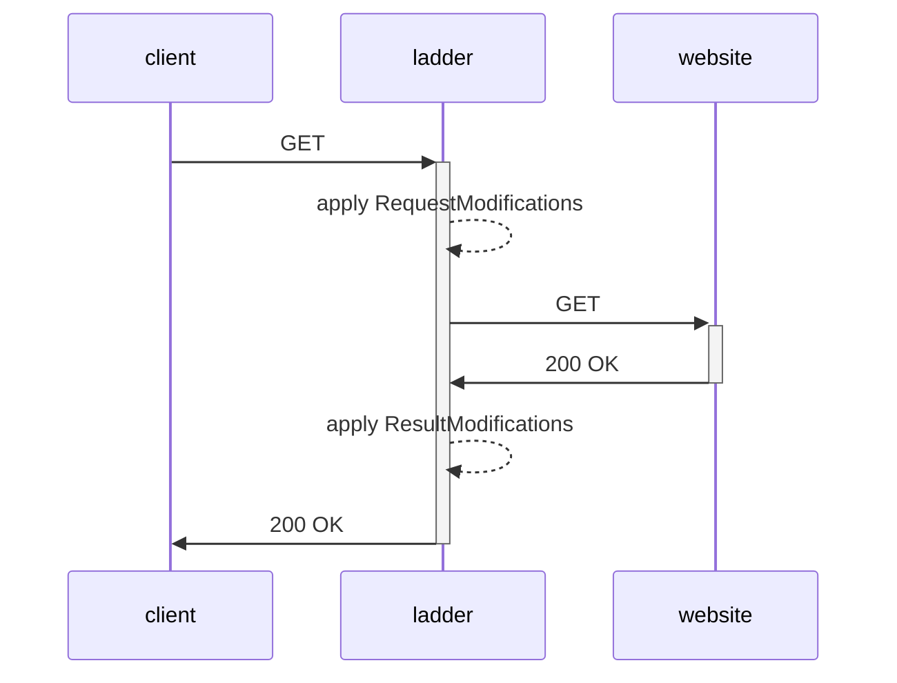

# How it works

Ladder applies a series of request and response modifications when proxying a site:

See [modifiers](/docs/category/modifiers/) for more details on the request and response modifiers available in Ladder.
